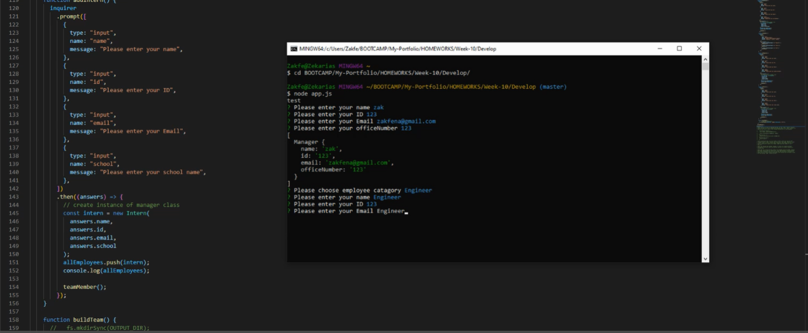

# Template Engine - Employee Summary

## Table of Contents

- [Installation](#installation)
- [Usage](#usage)
- [Credits](#credits)
- [License](#license)

## Description

This app collects information about the employees in a CLI the inquirer prompt and makes an html page.

## Installation

## Usage

Video Walkthrough

## Contribution

To contribute please pull code from Github.

## License

## Question

Contact: zakfena@gmail.com
Git Hub Page: zakfena
