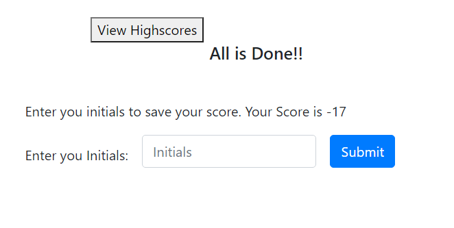

# Quiz App

## Table of Contents

- [Description](#Description)
- [Screen Shots](#Screen-Shots)
- [Technology Used](#Technology-Used)
- [License](#license)

## Deployed Site
 [Click Here ](https://zakfena.github.io/My-Portfolio/HOMEWORKS/Week-4-CodeQuiz/)

## Description
This is a quiz app wich lets the user take quiz. When the user starts quiz a timer will also start counting down. When the timer get to zero or the finishes the question, the user will be prompted to enter their initials and their score will be saved. The 'view score' button shows the list of the initials and scores. 

## Screen-Shots

## Technology-Used

- HTML
- CSS
- Javascript
- Bootstrap

## License

Copyright @ Zekarias Negassa 2020

## Question

If you have any questions please feel free to contact me.\
**Email:** zakfena@gmail.com\
**Git Hub** https://github.com/ZAKFENA

