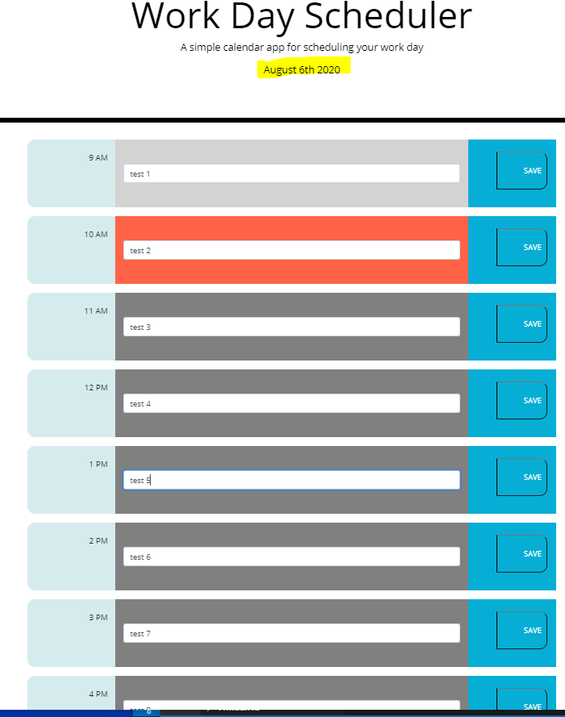

# Day Planner

## Table of Contents

- [Description](#Description)
- [Screen Shots](#Screen-Shots)
- [Technology Used](#Technology-Used)
- [License](#license)

## Deployed site
[Click Here](https://zakfena.github.io/My-Portfolio//HOMEWORKS/Week-5-DayPlanner/Develop/)

## Description

This is a day planner app that saves notes on a local storage. It uses moment.js for displaying times. All past, current and future hours have their own colors and automatically change. 

## Screen-Shots

## Technology-Used
- HTML
- CSS / Bootstrap
- Javascript
- moment.js

## License

## Question

If you have any questions please feel free to contact me.\
**Email:** zakfena@gmail.com\
**Git Hub** https://github.com/ZAKFENA

