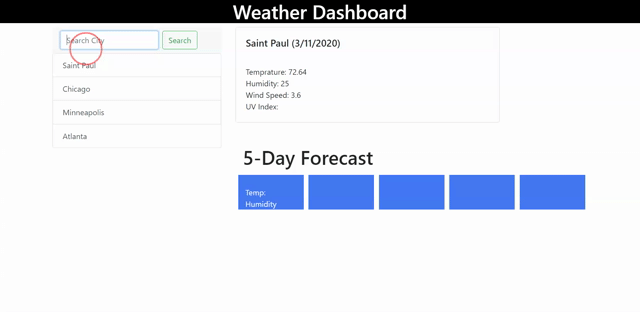

## Weather Dashboard

## Table of Contents

- [Description](#Description)
- [Screen Shots](#Screen-Shots)
- [Technology Used](#Technology-Used)
- [License](#license)

## Deployed Site
 [Click Here ](https://zakfena.github.io/Weather-Dashboard/index.html)

## Description
```
This site searches for cities and displays weather info for that city. It uses Open Weather API to get the info and store it on the local storage to display it as search history. It also displays the 5 day forecast for that city.

```

## Screen-Shots


## Technology-Used
```
HTML
CSS / BOOTSTRAP
Javascript
JQuery
AJAX
Open Weather API

```
## License

[](https://opensource.org/licenses/MIT)

## Question

If you have any questions please feel free to contact me.\
**Email:** zakfena@gmail.com\
**Git Hub** https://github.com/ZAKFENA
