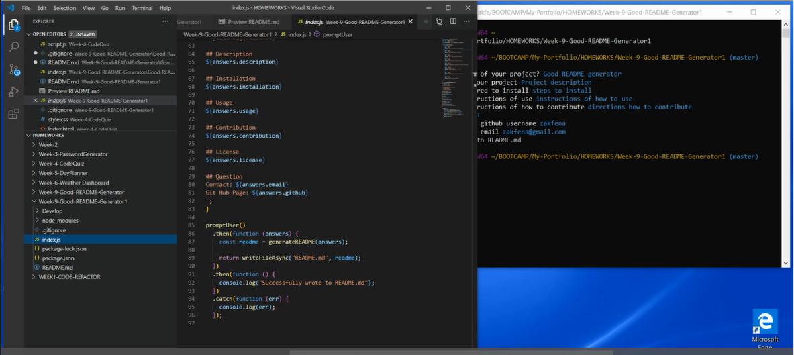
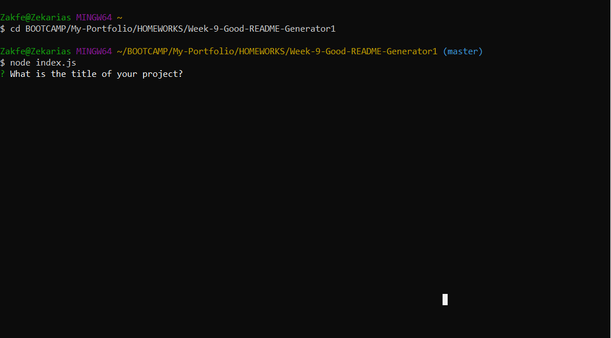
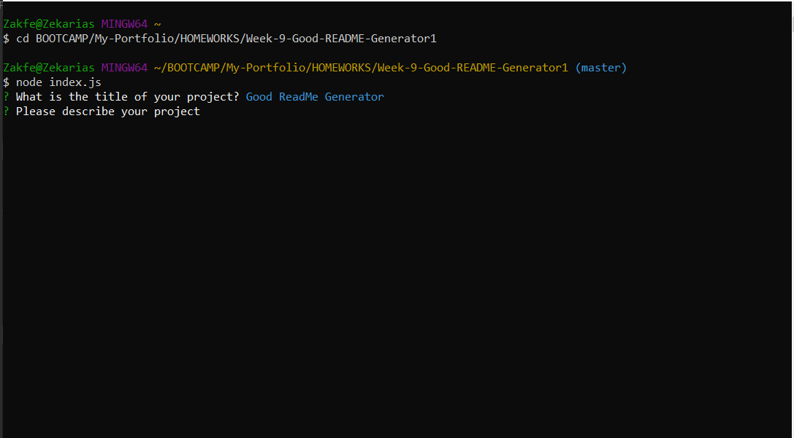

# Good README generator

## Table of Contents

- [Installation](#installation)
- [Usage](#usage)
- [Credits](#credits)
- [License](#license)

## Description

This app creates a README.MD file taking the responses given by the user. The user is presented with multiple questions about the app. The answer will then be used to fill in the sections of the README and a README.md file is created.

## Installation

1. Install Node.js
2. Clone repository
3. Open your Command Line and Run “npm init”
4. Run “npm I”
5. Run “node index.js”

## Usage

Video Walkthrough

Screen Shots

## Contribution

To contribute please pull code from Github.

## License

MIT

## Question

Contact: zakfena@gmail.com
Git Hub Page: zakfena
